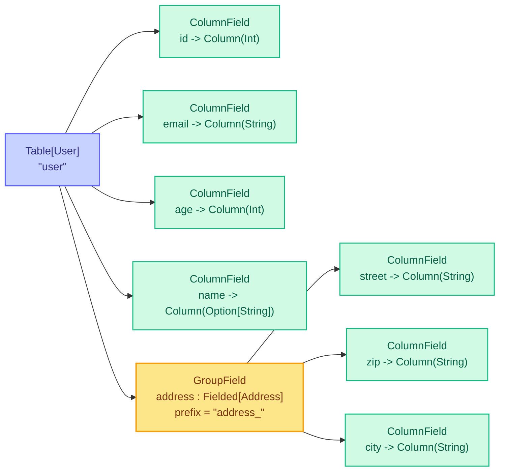

::left::

# Application

* We can traverse Case Classes!
* It needs some infrastructure to carry on:
  - Extracting the structure from case classes to generate **column names** at runtime
  - Nested field graph
* Core types
  * <InlineCode code="DataType" /> for SQL value types
  * <InlineCode code="Structure" /> = <InlineCode code="Column" /> or <InlineCode code="Fielded" />
  * <InlineCode code="Field" /> = <InlineCode code="ColumnField" /> or <InlineCode code="GroupField" />
  * <InlineCode code="Table" /> = <InlineCode code="Fielded" /> plus SQL table name
* Implementation in <InlineCode code="Fielded.scala" />
  * Derived by macros

::right::



---
subtitle: Application / ColumnPath
---

## ColumnPath

* The Navigator is now called <InlineCode code="ColumnPath" /> as in usql
* Same Approach, but always carrying the <InlineCode code="Structure" /> with it.
* Can extract Column names (by analyzing Structure)
* Basic Implementations
  * Root: We are starting somewhere
  * Child: We have selected a field from a parent
* Can be concatenated:
  * <InlineCode code="ColumnPath[A, B].append(ColumnPath[B, C]) => ColumnPath[A, C]" />
  * Replaying field selects.
* Implements simple SQL Comparison Operations via <InlineCode code="Rep[T]" />
* See file <InlineCode code="ColumnPath.scala" />

--- 
subtitle: Application / Filtering
---

## Query Builder: Table Select & Filtering

* Introducing <InlineCode code="QueryBuilder[T]" />
* Can be instantiated from <InlineCode code="Table[T]" /> (SQL Table): 
  * Default is a <InlineCode code="TableSelect"/> which does <InlineCode code="SELECT [column1], [...] FROM [tableName]" />
* Filter function:
  * <InlineCode code="def filter(predicate: ColumnPath[?, T] => Rep[Boolean]): QueryBuilder[T]" />
* For Filtering we just collect all these filters of type <InlineCode code="Rep[Boolean]" /> and serialize them into a generic statement
* Example <InlineCode code="QueryBuilder[User].filter(_.age > 18)" />

--- 
subtitle: Application / Projection
---

## Projection

* Projection with <InlineCode code="map" />:
```scala {1-3|1-6|1-9|1-12|1-13|1-15|1-21}
trait QueryBuilder[T] {

  def path: ColumnPath[?, T]
  
  def map[U](f: ColumnPath[T, T] => ColumnPath[T, U]): QueryBuilder[U] =
    project(f(ColumnPath.make[T](using structure)))
  
  def project[U](p: ColumnPath[T, U]): QueryBuilder[U] = 
    Projection[T, U](this, p)    
}

case class Projection[U, T](underlying: QueryBuilder[U], projection: ColumnPath[U, T]) extends QueryBuilder[T] {
  override val path: ColumnPath[?, T] = underlying.path.append(projection)

  override def sql: String = s"SELECT ${path.toSql} FROM (${underlying.sql})"

  // Use concatenation for chaining maps
  override def project[P](p: ColumnPath[T, P]): QueryBuilder[P] = copy(
    projection = projection.append(p)
  )
}
```

* Example in <InlineCode code="QueryBuilder.scala" />


--- 
subtitle: Application / Tuple Support
---

## Tuple Support

* Missing piece: 
  * We have <InlineCode code="ColumnPath[R, A]" />, but how is <InlineCode code="R => (A, B, C)" /> working?
* The map function <InlineCode code="x => (x.name, x.address.city, x.address.zip)" />
  * Generates: <InlineCode code="(ColumnPath[R, A], ColumnPath[R, B], ColumnPath[R, C])" />
  * But would need: <InlineCode code="ColumnPath[R, (A, B, C)]" />
* Solution: 
  * Given <InlineCode code="Structure" /> resembling tuple fields (<InlineCode code="_1" />, <InlineCode code="_2" />, <InlineCode code="_3" />)
  * Recursive Column Path for Tuples (<InlineCode code="EmptyTuplePath" />, <InlineCode code="RecTuplePath" />)
  * Implicit Conversion:
  * ```scala
    (ColumnPath[R, A], ColumnPath[R, B], ColumnPath[R, C]) => 
    
    ColumnPath[R, (A, B, C)]
    ```

---
subtitle: Application / Joins
---

## Joins

* Joins are the combination of two query builders with a join <InlineCode code="ON" />-criteria
```scala {1-5|1-8|1-10|1-17}
trait QueryBuilder[T] {
  def leftJoin[R](right: QueryBuilder[R])(
    on: (ColumnPath[?, T], ColumnPath[?, R]) => Rep[Boolean]
  ): QueryBuilder[(T, Optionalize[R])] = LeftJoin(this, right, on(path, right.path))
}

case class LeftJoin[L, R](left: QueryBuilder[L], right: QueryBuilder[R], on: Rep[Boolean])
  extends QueryBuilder[(L, Optionalize[R])] {
  
  override def sql: String = s"(${left.sql}) LEFT JOIN (${right.sql}) ON ${on.toSql}"

  override def path: ColumnPath[?, (L, Optionalize[R])] = {
    given leftPath: Structure[L]  = left.path.structure
    given rightPath: Structure[Optionalize[R]] = right.path.structure.optionalize
    ColumnPath.make[(L, Optionalize[R])]
  }
}
```

* Aliasing and collision handling is missing here.
* Example in <InlineCode code="QueryBuilder.scala:fullJoinExample" />

---
subtitle: Application / Recap
---

## Recap

- *NamedTuples* are cool!
- We have the QueryBuilder which can describe a path from <InlineCode code="R => T" />
- Together with the structure of a case class, we can 
  - Figure out **column names**
  - Figure out **the data type**
- Combining that we can generate Queries
  * Filtering
  * Projecting
  * Joining
- Syntax autocompletes (at least in VS Code)
- Type safety is present
