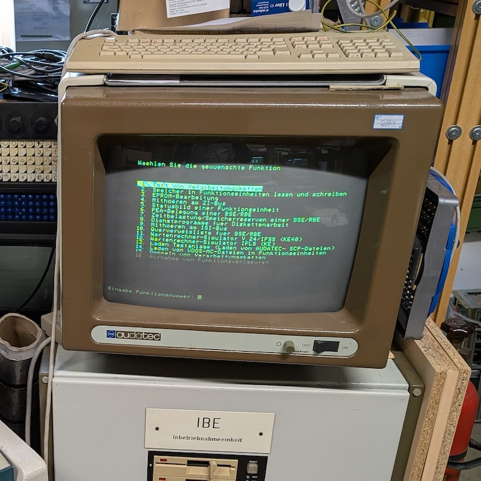

--- 
theme: seriph
background: PXL_20260206_151248158.jpg
transition: slide-left
mdc: true
duration: 30min

fonts:
  sans: "Helvetica Neue"
  mono: Menlo
  local: ["Helvetica Neue", "Menlo"]
--- 

# Named Tuples in Action

## Generating SQL Queries

Scalar 2026

Norbert Schultz, Reactive Core GmbH

---
subtitle: Agenda
---

# Table of Contents

- What we want
- Existing Solutions
- Named Tuples to rescue us
- Application: Generating Queries
- usql

---
src: ./1_problem.md
---

---
src: ./2_existing.md
---

---
src: ./3_named_tuples.md
---

---
src: ./4_application.md
---

---
src: ./5_usql.md
---

---
src: ./6_final.md
---

<!--
* Everyone enjoyed party?
* I tend to talk pretty fast, especially if I am nervous, so raise your hand if it is too fast.
* Thanks to the organizers, organizing this wonderful conference.
-->
